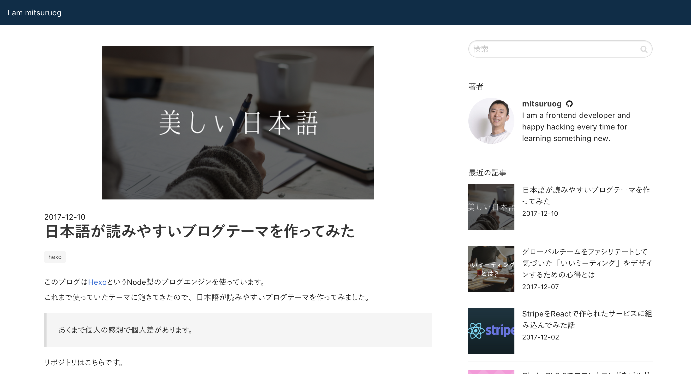

# hexo-theme-simple-japanese
Hexo blog theme. it makes Japanese more readable and beautiful.



## Demo

- https://blog.mitsuruog.info/

## Installation
1. Clone this repo into `theme/simple-japanese`.

```
# git clone
git clone https://github.com/mitsuruog/hexo-theme-simple-japanese.git themes/simple-japanese

# or fork this repo and install it as git submodule
git submodule add https://github.com/<your-username>/hexo-theme-simple-japanese.git themes/simple-japanese
```

2. Edit your `_config.yml`, change `theme` proprety to `simple-japanese` to enable theme.

```
- theme: simple-japanese
```

3. (Optional)Update theme.
if you use git submodule way, update your repo then update git submodule.

```
git submodule update --remote
```

## Features
### Sidebar
This theme provides 6 built-in widgets:
- search(google site search)
- profile
- recent_posts
- tagcloud
- archive

## Configuration
following settings are for theme.

```
# Site
author: YOUR_NAME
author_title: YOUR_DESCRIPTION
avatar: YOUR_AVATAR_URL

# URL
url: YOUR_BLOG_URL

# Sidebar
widgets:
  - search
  - profile
  - recent_posts
  - tagcloud
  - archive

# Contact
contact:
  url: YOUR_CONTACT_URL
  icon: github # font-awesome icon. e.x) fa-github

# Google tag manager
google_analytics: GTM-XXXXXX

# Custom assets
simple_japanese:
  custom_assets:
    css: css/custom.css
    // <link rel="stylesheet" href="/css/custom.css" type="text/css">
    js: js/custom.js
    // <script type="text/javascript" src="/js/custom.js"></script>
```

### favicon
Add icon file `source/favicon.ico`.

### AMP
Use this plugin as well.

- [tea3/hexo\-generator\-amp: AMP ⚡ HTML \(Accelerated Mobile Pages\) generator for Hexo\.](https://github.com/tea3/hexo-generator-amp)
